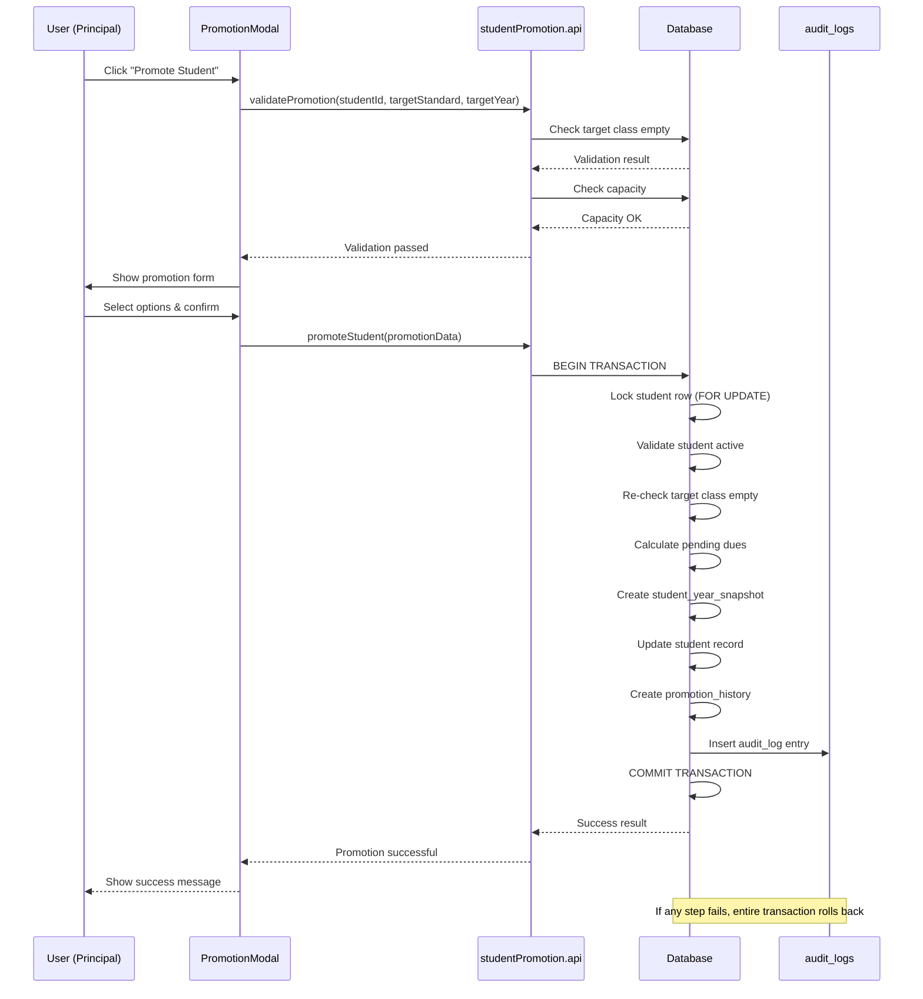
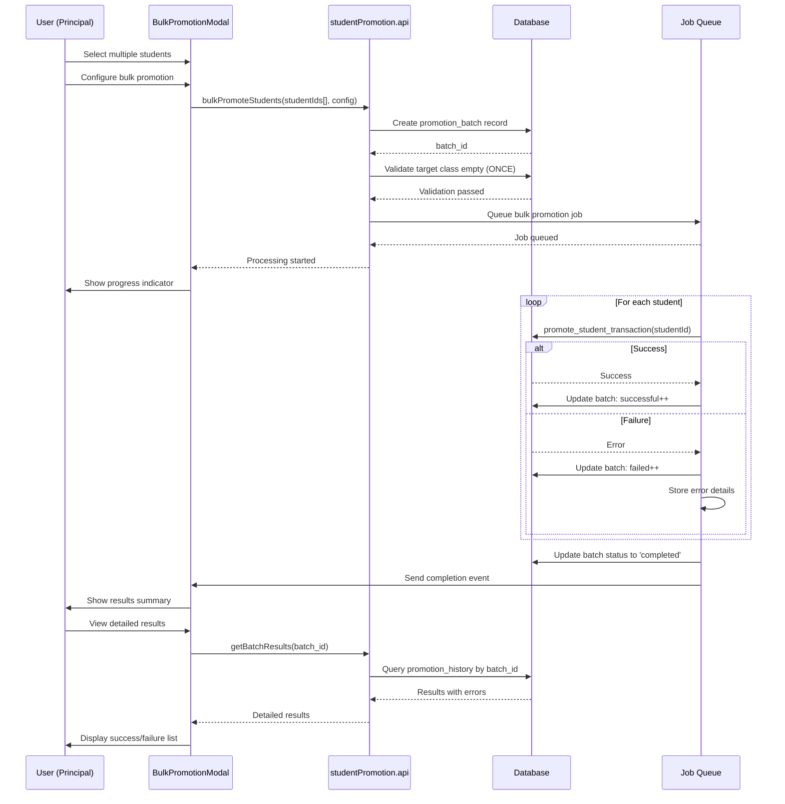
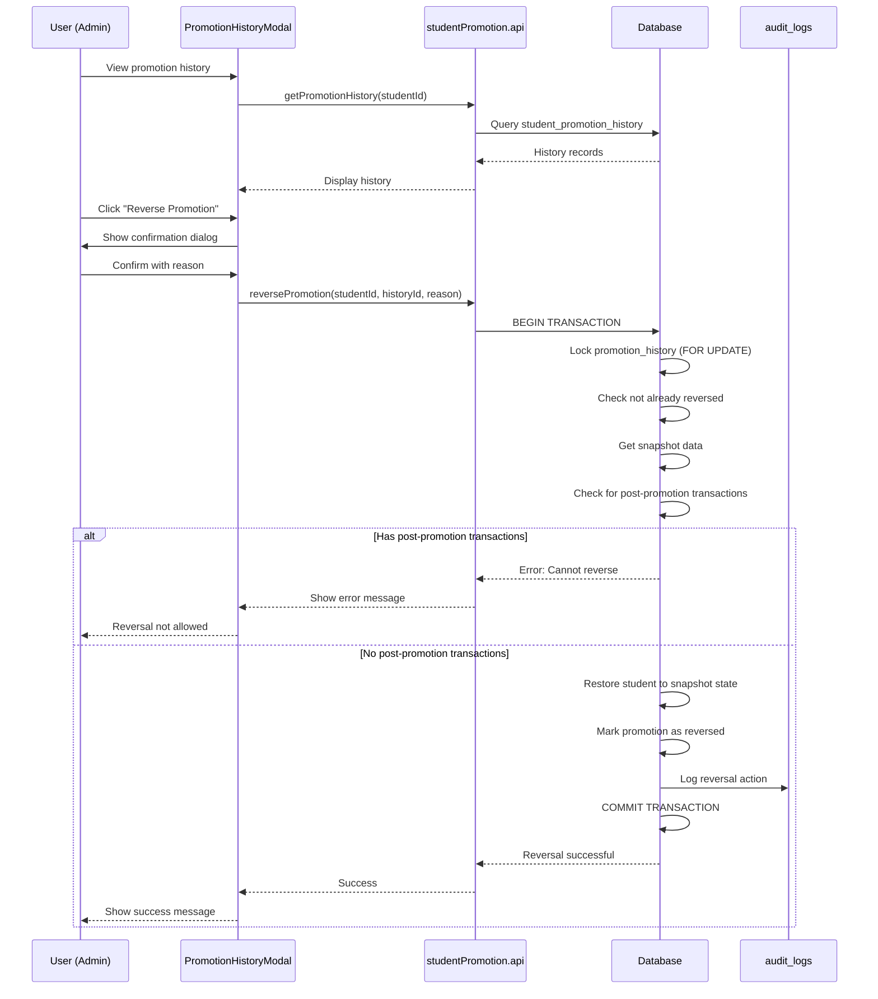
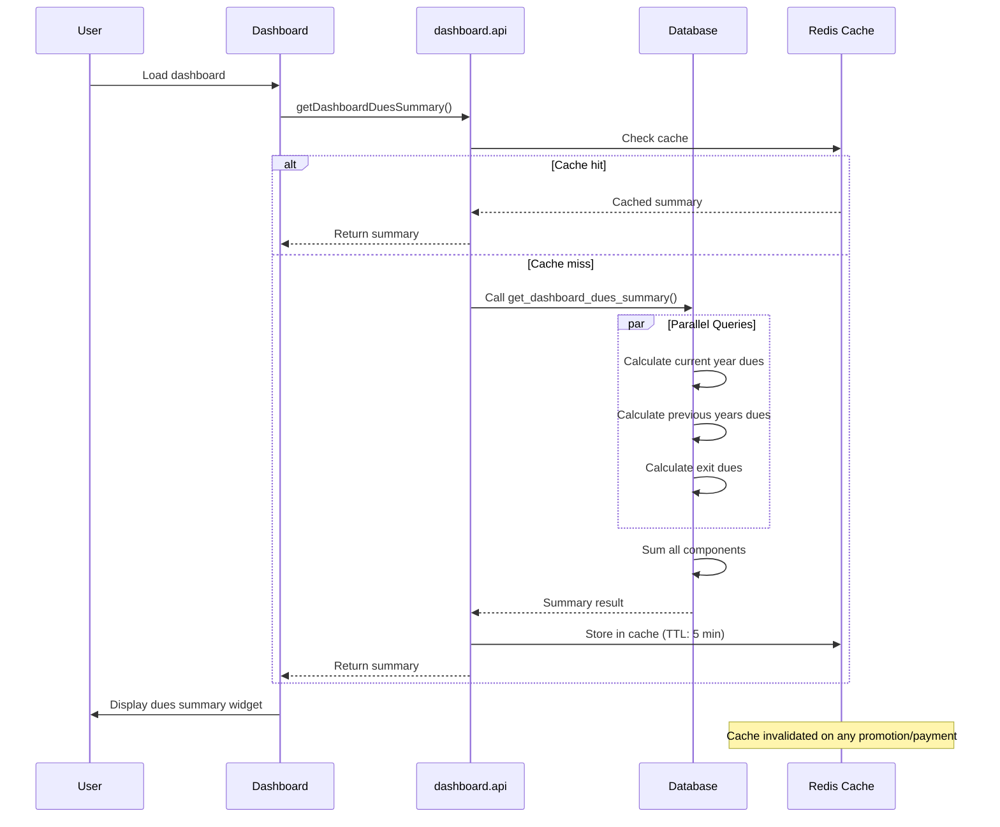
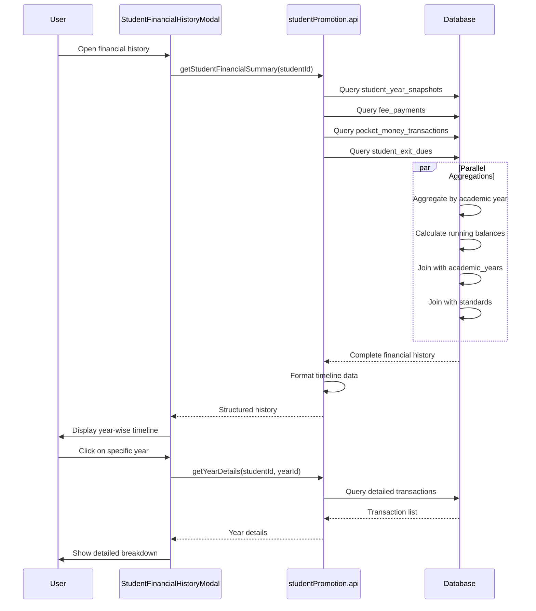

# Design Document: Student Promotion System

## Overview

The Student Promotion System is a comprehensive solution for managing academic year transitions in a school financial audit management system. It handles the complex workflow of promoting students between academic years while maintaining complete financial integrity, audit trails, and data consistency.

### Purpose

This system enables school administrators to:
- Promote students individually or in bulk to the next academic year
- Handle different academic outcomes (promoted, repeated, left school, graduated)
- Preserve complete financial history across academic years
- Prevent data integrity issues like class mixing
- Track all pending dues and pocket money balances
- Maintain immutable audit logs for financial compliance

### Key Design Principles

1. **Atomicity**: Each promotion is a single database transaction - either fully succeeds or fully rolls back
2. **Immutability**: Audit logs and historical records cannot be modified or deleted
3. **Consistency**: Data integrity is enforced at database level with constraints and validation
4. **Isolation**: Concurrent promotions are handled with optimistic locking to prevent conflicts
5. **Durability**: All financial records are preserved for minimum 7 years

### Scope

**In Scope:**
- Individual and bulk student promotions
- Financial dues tracking and carryforward
- Pocket money balance management
- Student exit with dues recording
- Promotion reversal (within same academic year)
- Historical transaction preservation
- Dashboard financial summaries
- Role-based access control
- Audit trail reporting

**Out of Scope:**
- Automated grade calculation or academic performance tracking
- Parent portal or notification delivery (integration points provided)
- Fee payment processing (uses existing payment system)
- Report card generation
- Attendance tracking


## Architecture

### High-Level Architecture

```
┌─────────────────────────────────────────────────────────────────┐
│                         Frontend Layer                           │
│  ┌──────────────────┐  ┌──────────────────┐  ┌───────────────┐ │
│  │ Promotion Page   │  │ Student Detail   │  │ Dashboard     │ │
│  │ - Individual     │  │ - History View   │  │ - Dues Summary│ │
│  │ - Bulk           │  │ - Financial Log  │  │ - Statistics  │ │
│  └──────────────────┘  └──────────────────┘  └───────────────┘ │
└─────────────────────────────────────────────────────────────────┘
                              ↓ ↑
┌─────────────────────────────────────────────────────────────────┐
│                      React Hooks Layer                           │
│  ┌──────────────────────────────────────────────────────────┐   │
│  │ usePromoteStudent, useBulkPromotion, usePromotionHistory │   │
│  │ useReversePromotion, useStudentFinancialSummary          │   │
│  └──────────────────────────────────────────────────────────┘   │
└─────────────────────────────────────────────────────────────────┘
                              ↓ ↑
┌─────────────────────────────────────────────────────────────────┐
│                         API Layer                                │
│  ┌──────────────────────────────────────────────────────────┐   │
│  │ studentPromotion.api.js                                  │   │
│  │ - promoteStudent(), bulkPromoteStudents()                │   │
│  │ - reversePromotion(), getPromotionHistory()              │   │
│  │ - validatePromotion(), getFinancialSummary()             │   │
│  └──────────────────────────────────────────────────────────┘   │
└─────────────────────────────────────────────────────────────────┘
                              ↓ ↑
┌─────────────────────────────────────────────────────────────────┐
│                    Supabase Database Layer                       │
│  ┌──────────────────┐  ┌──────────────────┐  ┌───────────────┐ │
│  │ Core Tables      │  │ Promotion Tables │  │ Audit Tables  │ │
│  │ - students       │  │ - student_year_  │  │ - promotion_  │ │
│  │ - academic_years │  │   snapshots      │  │   history     │ │
│  │ - standards      │  │ - promotion_     │  │ - audit_logs  │ │
│  │ - fee_configs    │  │   batches        │  │               │ │
│  └──────────────────┘  └──────────────────┘  └───────────────┘ │
│                                                                   │
│  ┌──────────────────────────────────────────────────────────┐   │
│  │ Database Functions (PL/pgSQL)                            │   │
│  │ - promote_student_transaction()                          │   │
│  │ - bulk_promote_students()                                │   │
│  │ - reverse_promotion_transaction()                        │   │
│  │ - validate_promotion_eligibility()                       │   │
│  │ - calculate_pending_dues()                               │   │
│  │ - create_year_snapshot()                                 │   │
│  └──────────────────────────────────────────────────────────┘   │
└─────────────────────────────────────────────────────────────────┘
```

### Data Flow

#### Individual Promotion Flow
```
User Action → Validation → Calculate Dues → Create Snapshot → 
Update Student → Create Audit Log → Update Dashboard Cache → Success
```

#### Bulk Promotion Flow
```
User Selects Students → Validate Target Class Empty → 
For Each Student (in transaction):
  → Validate Eligibility → Calculate Dues → Create Snapshot → 
  → Update Student → Log Result
→ Commit All or Rollback → Return Summary Report
```

### Technology Stack

- **Frontend**: React 18+ with Vite
- **State Management**: React Query (TanStack Query) for server state
- **Database**: Supabase PostgreSQL 15+
- **Authentication**: Supabase Auth with RLS
- **API**: Supabase Client SDK
- **UI Components**: Custom components with Tailwind CSS


## Components and Interfaces

### Frontend Components

#### 1. StudentPromotionPage
**Location**: `src/pages/Students/StudentPromotionPage.jsx`

**Purpose**: Main interface for managing student promotions

**Props**: None (uses route params for academic year)

**State**:
```javascript
{
  selectedStudents: Set<UUID>,
  targetAcademicYear: string,
  targetStandard: UUID,
  promotionAction: 'promoted' | 'repeated' | 'left_school',
  duesAction: 'carry_forward' | 'waive' | 'require_payment',
  filters: { standard: UUID, status: string, search: string },
  isProcessing: boolean
}
```

**Key Features**:
- Student list with selection checkboxes
- Filters by standard, status, search
- Bulk action toolbar
- Individual promotion buttons
- Real-time validation feedback
- Progress indicator for bulk operations

#### 2. PromotionModal
**Location**: `src/components/shared/PromotionModal.jsx`

**Purpose**: Handle individual student promotion with detailed options

**Props**:
```typescript
{
  student: Student,
  isOpen: boolean,
  onClose: () => void,
  onSuccess: () => void
}
```

**Features**:
- Student information display
- Current dues breakdown (fees + pocket money)
- Target academic year selection
- Target standard selection (with capacity validation)
- Promotion action radio buttons
- Dues handling options
- Validation warnings
- Confirmation step

#### 3. BulkPromotionModal
**Location**: `src/components/shared/BulkPromotionModal.jsx`

**Purpose**: Process multiple student promotions with batch configuration

**Props**:
```typescript
{
  students: Student[],
  isOpen: boolean,
  onClose: () => void,
  onSuccess: (results: PromotionResult[]) => void
}
```

**Features**:
- Selected students summary
- Common target year/standard
- Bulk dues action
- Pre-validation checks
- Progress bar during processing
- Results summary (success/failure counts)
- Detailed error list
- Export results option

#### 4. PromotionHistoryModal
**Location**: `src/components/shared/PromotionHistoryModal.jsx`

**Purpose**: Display year-wise promotion and financial history

**Props**:
```typescript
{
  studentId: UUID,
  isOpen: boolean,
  onClose: () => void
}
```

**Features**:
- Timeline view of academic years
- Promotion status per year
- Financial snapshot per year
- Dues carried forward
- Payment history links
- Reversal actions (if eligible)

#### 5. DashboardDuesSummaryWidget
**Location**: `src/components/dashboard/DuesSummaryWidget.jsx`

**Purpose**: Display aggregated dues across all years

**Features**:
- Current year dues
- Previous years dues
- Exit dues
- Total pending
- Drill-down links
- Refresh button

### React Hooks

#### usePromoteStudent
```javascript
const {
  mutate: promoteStudent,
  isLoading,
  error
} = usePromoteStudent();

// Usage
promoteStudent({
  studentId: 'uuid',
  targetAcademicYearId: 'uuid',
  targetStandardId: 'uuid',
  promotionStatus: 'promoted',
  duesAction: 'carry_forward',
  notes: 'Optional notes'
});
```

#### useBulkPromotion
```javascript
const {
  mutate: bulkPromote,
  isLoading,
  progress
} = useBulkPromotion();

// Usage
bulkPromote({
  studentIds: ['uuid1', 'uuid2'],
  targetAcademicYearId: 'uuid',
  targetStandardId: 'uuid',
  promotionStatus: 'promoted',
  duesAction: 'carry_forward'
});
```

#### usePromotionHistory
```javascript
const {
  data: history,
  isLoading,
  error
} = usePromotionHistory(studentId);

// Returns array of year snapshots
```

#### useReversePromotion
```javascript
const {
  mutate: reversePromotion,
  isLoading
} = useReversePromotion();

// Usage
reversePromotion({
  studentId: 'uuid',
  promotionHistoryId: 'uuid',
  reason: 'Incorrect promotion'
});
```

### API Functions

#### studentPromotion.api.js

```javascript
// Validate promotion eligibility
export async function validatePromotion(studentId, targetStandardId, targetAcademicYearId) {
  // Returns: { eligible: boolean, warnings: string[], errors: string[] }
}

// Promote single student
export async function promoteStudent(promotionData) {
  // Returns: { success: boolean, studentId: UUID, snapshotId: UUID }
}

// Bulk promote students
export async function bulkPromoteStudents(bulkData) {
  // Returns: { 
  //   totalProcessed: number,
  //   successful: number,
  //   failed: number,
  //   results: PromotionResult[]
  // }
}

// Reverse promotion
export async function reversePromotion(studentId, promotionHistoryId, reason) {
  // Returns: { success: boolean, restoredState: StudentState }
}

// Get promotion history
export async function getPromotionHistory(studentId) {
  // Returns: YearSnapshot[]
}

// Get financial summary across years
export async function getStudentFinancialSummary(studentId) {
  // Returns: {
  //   currentYearDues: number,
  //   previousYearsDues: number,
  //   totalPaid: number,
  //   pocketMoneyBalance: number
  // }
}

// Get dashboard dues summary
export async function getDashboardDuesSummary() {
  // Returns: {
  //   currentYearDues: number,
  //   previousYearsDues: number,
  //   exitDues: number,
  //   totalPending: number
  // }
}
```


## Data Models

### Database Schema

#### New Tables

##### 1. student_year_snapshots
Stores immutable snapshot of student's financial state at end of each academic year.

```sql
CREATE TABLE student_year_snapshots (
  id UUID PRIMARY KEY DEFAULT uuid_generate_v4(),
  student_id UUID NOT NULL REFERENCES students(id) ON DELETE RESTRICT,
  academic_year_id UUID NOT NULL REFERENCES academic_years(id) ON DELETE RESTRICT,
  standard_id UUID NOT NULL REFERENCES standards(id) ON DELETE RESTRICT,
  
  -- Financial snapshot
  annual_fee_paise BIGINT NOT NULL,
  fee_paid_paise BIGINT NOT NULL,
  fee_due_paise BIGINT NOT NULL, -- Calculated: annual - paid
  pocket_money_paise BIGINT NOT NULL,
  
  -- Promotion details
  promotion_status TEXT NOT NULL CHECK (promotion_status IN 
    ('promoted', 'repeated', 'left_school', 'graduated')),
  promoted_to_standard_id UUID REFERENCES standards(id),
  promoted_to_academic_year_id UUID REFERENCES academic_years(id),
  
  -- Dues handling
  dues_action TEXT NOT NULL CHECK (dues_action IN 
    ('carried_forward', 'waived', 'paid_before_promotion', 'exit_recorded')),
  dues_carried_forward_paise BIGINT NOT NULL DEFAULT 0,
  
  -- Metadata
  snapshot_date TIMESTAMPTZ NOT NULL DEFAULT NOW(),
  created_by UUID NOT NULL REFERENCES auth.users(id),
  notes TEXT,
  
  -- Constraints
  UNIQUE (student_id, academic_year_id),
  CHECK (fee_due_paise >= 0),
  CHECK (dues_carried_forward_paise >= 0)
);

CREATE INDEX idx_snapshots_student ON student_year_snapshots(student_id, academic_year_id DESC);
CREATE INDEX idx_snapshots_year ON student_year_snapshots(academic_year_id);
CREATE INDEX idx_snapshots_status ON student_year_snapshots(promotion_status);
```

##### 2. promotion_batches
Tracks bulk promotion operations for auditing and rollback.

```sql
CREATE TABLE promotion_batches (
  id UUID PRIMARY KEY DEFAULT uuid_generate_v4(),
  batch_name TEXT NOT NULL,
  source_academic_year_id UUID NOT NULL REFERENCES academic_years(id),
  target_academic_year_id UUID NOT NULL REFERENCES academic_years(id),
  target_standard_id UUID REFERENCES standards(id), -- NULL for mixed promotions
  
  -- Statistics
  total_students INTEGER NOT NULL,
  successful_promotions INTEGER NOT NULL DEFAULT 0,
  failed_promotions INTEGER NOT NULL DEFAULT 0,
  
  -- Status
  status TEXT NOT NULL CHECK (status IN 
    ('pending', 'processing', 'completed', 'failed', 'partially_completed')),
  
  -- Metadata
  started_at TIMESTAMPTZ NOT NULL DEFAULT NOW(),
  completed_at TIMESTAMPTZ,
  created_by UUID NOT NULL REFERENCES auth.users(id),
  error_summary JSONB,
  
  CHECK (successful_promotions + failed_promotions <= total_students)
);

CREATE INDEX idx_batches_year ON promotion_batches(target_academic_year_id);
CREATE INDEX idx_batches_status ON promotion_batches(status);
CREATE INDEX idx_batches_created ON promotion_batches(created_at DESC);
```

##### 3. student_promotion_history
Detailed log of each promotion action (links to snapshots).

```sql
CREATE TABLE student_promotion_history (
  id UUID PRIMARY KEY DEFAULT uuid_generate_v4(),
  student_id UUID NOT NULL REFERENCES students(id) ON DELETE RESTRICT,
  snapshot_id UUID NOT NULL REFERENCES student_year_snapshots(id) ON DELETE RESTRICT,
  batch_id UUID REFERENCES promotion_batches(id) ON DELETE SET NULL,
  
  -- Promotion details
  from_academic_year_id UUID NOT NULL REFERENCES academic_years(id),
  to_academic_year_id UUID NOT NULL REFERENCES academic_years(id),
  from_standard_id UUID NOT NULL REFERENCES standards(id),
  to_standard_id UUID REFERENCES standards(id), -- NULL for left_school/graduated
  
  promotion_status TEXT NOT NULL CHECK (promotion_status IN 
    ('promoted', 'repeated', 'left_school', 'graduated')),
  
  -- Reversal tracking
  is_reversed BOOLEAN NOT NULL DEFAULT FALSE,
  reversed_at TIMESTAMPTZ,
  reversed_by UUID REFERENCES auth.users(id),
  reversal_reason TEXT,
  
  -- Metadata
  promoted_at TIMESTAMPTZ NOT NULL DEFAULT NOW(),
  promoted_by UUID NOT NULL REFERENCES auth.users(id),
  notes TEXT,
  
  UNIQUE (student_id, from_academic_year_id)
);

CREATE INDEX idx_promo_history_student ON student_promotion_history(student_id, promoted_at DESC);
CREATE INDEX idx_promo_history_batch ON student_promotion_history(batch_id);
CREATE INDEX idx_promo_history_reversed ON student_promotion_history(is_reversed);
```

##### 4. fee_adjustments
Tracks fee waivers, scholarships, and adjustments during promotion.

```sql
CREATE TABLE fee_adjustments (
  id UUID PRIMARY KEY DEFAULT uuid_generate_v4(),
  student_id UUID NOT NULL REFERENCES students(id) ON DELETE RESTRICT,
  academic_year_id UUID NOT NULL REFERENCES academic_years(id) ON DELETE RESTRICT,
  
  adjustment_type TEXT NOT NULL CHECK (adjustment_type IN 
    ('scholarship', 'sibling_discount', 'fee_waiver', 'pro_rated', 'other')),
  
  amount_paise BIGINT NOT NULL CHECK (amount_paise >= 0),
  percentage DECIMAL(5,2), -- For percentage-based adjustments
  
  reason TEXT NOT NULL,
  approved_by UUID NOT NULL REFERENCES auth.users(id),
  approved_at TIMESTAMPTZ NOT NULL DEFAULT NOW(),
  
  -- Validity
  valid_from DATE NOT NULL,
  valid_until DATE,
  is_active BOOLEAN NOT NULL DEFAULT TRUE,
  
  notes TEXT
);

CREATE INDEX idx_adjustments_student ON fee_adjustments(student_id, academic_year_id);
CREATE INDEX idx_adjustments_type ON fee_adjustments(adjustment_type);
CREATE INDEX idx_adjustments_active ON fee_adjustments(is_active, valid_from, valid_until);
```

#### Modified Tables

##### students table (add columns)
```sql
ALTER TABLE students ADD COLUMN IF NOT EXISTS 
  last_promoted_at TIMESTAMPTZ;

ALTER TABLE students ADD COLUMN IF NOT EXISTS 
  promotion_eligible BOOLEAN NOT NULL DEFAULT TRUE;

ALTER TABLE students ADD COLUMN IF NOT EXISTS 
  promotion_hold_reason TEXT;
```

##### academic_years table (add columns)
```sql
ALTER TABLE academic_years ADD COLUMN IF NOT EXISTS 
  promotion_start_date DATE;

ALTER TABLE academic_years ADD COLUMN IF NOT EXISTS 
  promotion_end_date DATE;

ALTER TABLE academic_years ADD COLUMN IF NOT EXISTS 
  promotion_locked BOOLEAN NOT NULL DEFAULT FALSE;
```

##### standards table (add columns)
```sql
ALTER TABLE standards ADD COLUMN IF NOT EXISTS 
  max_capacity INTEGER;

ALTER TABLE standards ADD COLUMN IF NOT EXISTS 
  is_final_year BOOLEAN NOT NULL DEFAULT FALSE;
```

### Data Relationships

```
students (1) ──→ (N) student_year_snapshots
students (1) ──→ (N) student_promotion_history
students (1) ──→ (N) fee_adjustments

academic_years (1) ──→ (N) student_year_snapshots
academic_years (1) ──→ (N) promotion_batches

standards (1) ──→ (N) student_year_snapshots
standards (1) ──→ (N) student_promotion_history

promotion_batches (1) ──→ (N) student_promotion_history

student_year_snapshots (1) ──→ (1) student_promotion_history
```

### Indexes for Performance

```sql
-- Composite indexes for common queries
CREATE INDEX idx_students_year_standard_status 
  ON students(academic_year_id, standard_id, status) 
  WHERE is_deleted = FALSE;

CREATE INDEX idx_students_promotion_eligible 
  ON students(promotion_eligible, academic_year_id) 
  WHERE is_deleted = FALSE AND status = 'active';

-- Covering index for dashboard queries
CREATE INDEX idx_snapshots_dues_summary 
  ON student_year_snapshots(academic_year_id, promotion_status) 
  INCLUDE (fee_due_paise, pocket_money_paise, dues_carried_forward_paise);

-- Index for financial history queries
CREATE INDEX idx_snapshots_student_financial 
  ON student_year_snapshots(student_id, academic_year_id) 
  INCLUDE (fee_due_paise, pocket_money_paise, dues_carried_forward_paise);
```


## Database Functions

### Core Promotion Functions

#### 1. promote_student_transaction()
```sql
CREATE OR REPLACE FUNCTION promote_student_transaction(
  p_student_id UUID,
  p_target_academic_year_id UUID,
  p_target_standard_id UUID,
  p_promotion_status TEXT,
  p_dues_action TEXT,
  p_promoted_by UUID,
  p_notes TEXT DEFAULT NULL
) RETURNS JSONB
LANGUAGE plpgsql
SECURITY DEFINER
AS $
DECLARE
  v_snapshot_id UUID;
  v_current_year_id UUID;
  v_current_standard_id UUID;
  v_fee_due BIGINT;
  v_pocket_money BIGINT;
  v_result JSONB;
BEGIN
  -- Start transaction (implicit in function)
  
  -- 1. Validate student exists and is active
  SELECT academic_year_id, standard_id, 
         (annual_fee_paise - fee_paid_paise), pocket_money_paise
  INTO v_current_year_id, v_current_standard_id, v_fee_due, v_pocket_money
  FROM students
  WHERE id = p_student_id AND status = 'active' AND is_deleted = FALSE
  FOR UPDATE; -- Lock row for update
  
  IF NOT FOUND THEN
    RAISE EXCEPTION 'Student not found or not active';
  END IF;
  
  -- 2. Validate target class is empty (if promoting to new standard)
  IF p_promotion_status = 'promoted' AND p_target_standard_id IS NOT NULL THEN
    IF EXISTS (
      SELECT 1 FROM students 
      WHERE academic_year_id = p_target_academic_year_id 
        AND standard_id = p_target_standard_id
        AND is_deleted = FALSE
    ) THEN
      RAISE EXCEPTION 'Target class already contains students';
    END IF;
  END IF;
  
  -- 3. Check capacity if defined
  IF p_target_standard_id IS NOT NULL THEN
    PERFORM validate_standard_capacity(p_target_standard_id, p_target_academic_year_id);
  END IF;
  
  -- 4. Create year snapshot
  INSERT INTO student_year_snapshots (
    student_id, academic_year_id, standard_id,
    annual_fee_paise, fee_paid_paise, fee_due_paise, pocket_money_paise,
    promotion_status, promoted_to_standard_id, promoted_to_academic_year_id,
    dues_action, dues_carried_forward_paise,
    created_by, notes
  ) VALUES (
    p_student_id, v_current_year_id, v_current_standard_id,
    (SELECT annual_fee_paise FROM students WHERE id = p_student_id),
    (SELECT fee_paid_paise FROM students WHERE id = p_student_id),
    v_fee_due,
    v_pocket_money,
    p_promotion_status, p_target_standard_id, p_target_academic_year_id,
    p_dues_action,
    CASE 
      WHEN p_dues_action = 'carried_forward' THEN v_fee_due + LEAST(v_pocket_money, 0)
      ELSE 0
    END,
    p_promoted_by, p_notes
  ) RETURNING id INTO v_snapshot_id;
  
  -- 5. Update student record
  IF p_promotion_status = 'promoted' THEN
    UPDATE students SET
      academic_year_id = p_target_academic_year_id,
      standard_id = p_target_standard_id,
      annual_fee_paise = get_fee_for_standard(p_target_standard_id, p_target_academic_year_id),
      fee_paid_paise = 0,
      pocket_money_paise = CASE 
        WHEN p_dues_action = 'carried_forward' THEN GREATEST(v_pocket_money, 0)
        WHEN p_dues_action = 'waived' THEN 0
        ELSE v_pocket_money
      END,
      last_promoted_at = NOW(),
      updated_at = NOW()
    WHERE id = p_student_id;
    
  ELSIF p_promotion_status = 'repeated' THEN
    UPDATE students SET
      academic_year_id = p_target_academic_year_id,
      -- standard_id stays same
      annual_fee_paise = get_fee_for_standard(v_current_standard_id, p_target_academic_year_id),
      fee_paid_paise = 0,
      pocket_money_paise = CASE 
        WHEN p_dues_action = 'carried_forward' THEN GREATEST(v_pocket_money, 0)
        ELSE 0
      END,
      last_promoted_at = NOW(),
      updated_at = NOW()
    WHERE id = p_student_id;
    
  ELSIF p_promotion_status IN ('left_school', 'graduated') THEN
    UPDATE students SET
      status = CASE 
        WHEN p_promotion_status = 'graduated' THEN 'alumni'
        ELSE 'withdrawn'
      END,
      updated_at = NOW()
    WHERE id = p_student_id;
    
    -- Record exit dues if any
    IF v_fee_due > 0 OR v_pocket_money < 0 THEN
      PERFORM record_exit_dues(p_student_id, v_current_year_id, 
                               v_fee_due + LEAST(v_pocket_money, 0));
    END IF;
  END IF;
  
  -- 6. Create promotion history record
  INSERT INTO student_promotion_history (
    student_id, snapshot_id, from_academic_year_id, to_academic_year_id,
    from_standard_id, to_standard_id, promotion_status,
    promoted_by, notes
  ) VALUES (
    p_student_id, v_snapshot_id, v_current_year_id, p_target_academic_year_id,
    v_current_standard_id, p_target_standard_id, p_promotion_status,
    p_promoted_by, p_notes
  );
  
  -- 7. Create audit log
  INSERT INTO audit_logs (
    action_type, entity_type, entity_id, entity_label,
    performed_by, performer_name, performer_role,
    description, academic_year_id,
    old_value, new_value
  ) SELECT
    'PROMOTION', 'student', p_student_id, s.full_name,
    p_promoted_by, up.full_name, up.role,
    format('Student %s %s from %s to %s', 
           s.full_name, p_promotion_status, 
           ay1.year_label, ay2.year_label),
    p_target_academic_year_id,
    jsonb_build_object(
      'academic_year', v_current_year_id,
      'standard', v_current_standard_id,
      'fee_due', v_fee_due,
      'pocket_money', v_pocket_money
    ),
    jsonb_build_object(
      'academic_year', p_target_academic_year_id,
      'standard', p_target_standard_id,
      'promotion_status', p_promotion_status,
      'dues_action', p_dues_action
    )
  FROM students s
  JOIN user_profiles up ON up.id = p_promoted_by
  JOIN academic_years ay1 ON ay1.id = v_current_year_id
  JOIN academic_years ay2 ON ay2.id = p_target_academic_year_id
  WHERE s.id = p_student_id;
  
  -- Return success result
  v_result := jsonb_build_object(
    'success', true,
    'student_id', p_student_id,
    'snapshot_id', v_snapshot_id,
    'promotion_status', p_promotion_status
  );
  
  RETURN v_result;
  
EXCEPTION
  WHEN OTHERS THEN
    -- Rollback happens automatically
    RETURN jsonb_build_object(
      'success', false,
      'error', SQLERRM,
      'student_id', p_student_id
    );
END;
$;
```

#### 2. bulk_promote_students()
```sql
CREATE OR REPLACE FUNCTION bulk_promote_students(
  p_student_ids UUID[],
  p_target_academic_year_id UUID,
  p_target_standard_id UUID,
  p_promotion_status TEXT,
  p_dues_action TEXT,
  p_promoted_by UUID,
  p_batch_name TEXT DEFAULT NULL
) RETURNS JSONB
LANGUAGE plpgsql
SECURITY DEFINER
AS $
DECLARE
  v_batch_id UUID;
  v_student_id UUID;
  v_result JSONB;
  v_results JSONB[] := '{}';
  v_successful INTEGER := 0;
  v_failed INTEGER := 0;
BEGIN
  -- Create batch record
  INSERT INTO promotion_batches (
    batch_name, source_academic_year_id, target_academic_year_id,
    target_standard_id, total_students, status, created_by
  ) SELECT
    COALESCE(p_batch_name, 'Bulk Promotion ' || NOW()::TEXT),
    (SELECT DISTINCT academic_year_id FROM students WHERE id = ANY(p_student_ids) LIMIT 1),
    p_target_academic_year_id,
    p_target_standard_id,
    array_length(p_student_ids, 1),
    'processing',
    p_promoted_by
  RETURNING id INTO v_batch_id;
  
  -- Validate target class is empty ONCE before processing
  IF p_promotion_status = 'promoted' AND p_target_standard_id IS NOT NULL THEN
    IF EXISTS (
      SELECT 1 FROM students 
      WHERE academic_year_id = p_target_academic_year_id 
        AND standard_id = p_target_standard_id
        AND is_deleted = FALSE
    ) THEN
      UPDATE promotion_batches SET status = 'failed', completed_at = NOW()
      WHERE id = v_batch_id;
      
      RETURN jsonb_build_object(
        'success', false,
        'error', 'Target class already contains students',
        'batch_id', v_batch_id
      );
    END IF;
  END IF;
  
  -- Process each student independently
  FOREACH v_student_id IN ARRAY p_student_ids
  LOOP
    BEGIN
      -- Call single promotion function
      v_result := promote_student_transaction(
        v_student_id, p_target_academic_year_id, p_target_standard_id,
        p_promotion_status, p_dues_action, p_promoted_by, NULL
      );
      
      -- Update batch record with batch_id
      UPDATE student_promotion_history 
      SET batch_id = v_batch_id
      WHERE student_id = v_student_id 
        AND to_academic_year_id = p_target_academic_year_id
        AND promoted_at = (
          SELECT MAX(promoted_at) FROM student_promotion_history 
          WHERE student_id = v_student_id
        );
      
      IF (v_result->>'success')::BOOLEAN THEN
        v_successful := v_successful + 1;
      ELSE
        v_failed := v_failed + 1;
      END IF;
      
      v_results := array_append(v_results, v_result);
      
    EXCEPTION
      WHEN OTHERS THEN
        v_failed := v_failed + 1;
        v_results := array_append(v_results, jsonb_build_object(
          'success', false,
          'student_id', v_student_id,
          'error', SQLERRM
        ));
    END;
  END LOOP;
  
  -- Update batch status
  UPDATE promotion_batches SET
    successful_promotions = v_successful,
    failed_promotions = v_failed,
    status = CASE 
      WHEN v_failed = 0 THEN 'completed'
      WHEN v_successful = 0 THEN 'failed'
      ELSE 'partially_completed'
    END,
    completed_at = NOW()
  WHERE id = v_batch_id;
  
  RETURN jsonb_build_object(
    'success', true,
    'batch_id', v_batch_id,
    'total_processed', array_length(p_student_ids, 1),
    'successful', v_successful,
    'failed', v_failed,
    'results', v_results
  );
END;
$;
```

#### 3. reverse_promotion_transaction()
```sql
CREATE OR REPLACE FUNCTION reverse_promotion_transaction(
  p_student_id UUID,
  p_promotion_history_id UUID,
  p_reversed_by UUID,
  p_reversal_reason TEXT
) RETURNS JSONB
LANGUAGE plpgsql
SECURITY DEFINER
AS $
DECLARE
  v_history RECORD;
  v_snapshot RECORD;
  v_has_transactions BOOLEAN;
BEGIN
  -- Get promotion history
  SELECT * INTO v_history
  FROM student_promotion_history
  WHERE id = p_promotion_history_id AND student_id = p_student_id
  FOR UPDATE;
  
  IF NOT FOUND THEN
    RAISE EXCEPTION 'Promotion history not found';
  END IF;
  
  IF v_history.is_reversed THEN
    RAISE EXCEPTION 'Promotion already reversed';
  END IF;
  
  -- Get snapshot
  SELECT * INTO v_snapshot
  FROM student_year_snapshots
  WHERE id = v_history.snapshot_id;
  
  -- Check for post-promotion transactions
  SELECT EXISTS (
    SELECT 1 FROM fee_payments
    WHERE student_id = p_student_id 
      AND academic_year_id = v_history.to_academic_year_id
      AND created_at > v_history.promoted_at
  ) OR EXISTS (
    SELECT 1 FROM pocket_money_transactions
    WHERE student_id = p_student_id
      AND created_at > v_history.promoted_at
  ) INTO v_has_transactions;
  
  IF v_has_transactions THEN
    RAISE EXCEPTION 'Cannot reverse: financial transactions occurred after promotion';
  END IF;
  
  -- Restore student to previous state
  UPDATE students SET
    academic_year_id = v_history.from_academic_year_id,
    standard_id = v_history.from_standard_id,
    annual_fee_paise = v_snapshot.annual_fee_paise,
    fee_paid_paise = v_snapshot.fee_paid_paise,
    pocket_money_paise = v_snapshot.pocket_money_paise,
    status = 'active',
    updated_at = NOW()
  WHERE id = p_student_id;
  
  -- Mark promotion as reversed
  UPDATE student_promotion_history SET
    is_reversed = TRUE,
    reversed_at = NOW(),
    reversed_by = p_reversed_by,
    reversal_reason = p_reversal_reason
  WHERE id = p_promotion_history_id;
  
  -- Create audit log
  INSERT INTO audit_logs (
    action_type, entity_type, entity_id, entity_label,
    performed_by, performer_name, performer_role,
    description, academic_year_id
  ) SELECT
    'REVERSE', 'student', p_student_id, s.full_name,
    p_reversed_by, up.full_name, up.role,
    format('Reversed promotion for %s. Reason: %s', s.full_name, p_reversal_reason),
    v_history.from_academic_year_id
  FROM students s
  JOIN user_profiles up ON up.id = p_reversed_by
  WHERE s.id = p_student_id;
  
  RETURN jsonb_build_object(
    'success', true,
    'student_id', p_student_id,
    'restored_year', v_history.from_academic_year_id,
    'restored_standard', v_history.from_standard_id
  );
  
EXCEPTION
  WHEN OTHERS THEN
    RETURN jsonb_build_object(
      'success', false,
      'error', SQLERRM
    );
END;
$;
```

### Validation Functions

#### validate_standard_capacity()
```sql
CREATE OR REPLACE FUNCTION validate_standard_capacity(
  p_standard_id UUID,
  p_academic_year_id UUID
) RETURNS VOID
LANGUAGE plpgsql
AS $
DECLARE
  v_capacity INTEGER;
  v_current_count INTEGER;
BEGIN
  -- Get capacity
  SELECT max_capacity INTO v_capacity
  FROM standards
  WHERE id = p_standard_id;
  
  -- If no capacity defined, allow unlimited
  IF v_capacity IS NULL THEN
    RETURN;
  END IF;
  
  -- Count current students
  SELECT COUNT(*) INTO v_current_count
  FROM students
  WHERE standard_id = p_standard_id
    AND academic_year_id = p_academic_year_id
    AND is_deleted = FALSE
    AND status = 'active';
  
  IF v_current_count >= v_capacity THEN
    RAISE EXCEPTION 'Standard capacity exceeded: % / %', v_current_count, v_capacity;
  END IF;
END;
$;
```

#### calculate_pending_dues()
```sql
CREATE OR REPLACE FUNCTION calculate_pending_dues(
  p_student_id UUID
) RETURNS BIGINT
LANGUAGE plpgsql
AS $
DECLARE
  v_annual_fee BIGINT;
  v_fee_paid BIGINT;
  v_pocket_money BIGINT;
  v_total_due BIGINT;
BEGIN
  SELECT annual_fee_paise, fee_paid_paise, pocket_money_paise
  INTO v_annual_fee, v_fee_paid, v_pocket_money
  FROM students
  WHERE id = p_student_id;
  
  -- Calculate: (annual_fee - fee_paid) + negative_pocket_money
  v_total_due := (v_annual_fee - v_fee_paid) + LEAST(v_pocket_money, 0);
  
  RETURN GREATEST(v_total_due, 0);
END;
$;
```

### Query Functions

#### get_student_financial_summary()
```sql
CREATE OR REPLACE FUNCTION get_student_financial_summary(
  p_student_id UUID
) RETURNS JSONB
LANGUAGE plpgsql
AS $
DECLARE
  v_result JSONB;
BEGIN
  SELECT jsonb_build_object(
    'current_year_dues', calculate_pending_dues(p_student_id),
    'previous_years_dues', (
      SELECT COALESCE(SUM(dues_carried_forward_paise), 0)
      FROM student_year_snapshots
      WHERE student_id = p_student_id
    ),
    'total_paid', (
      SELECT COALESCE(SUM(amount_paise), 0)
      FROM fee_payments
      WHERE student_id = p_student_id
    ),
    'pocket_money_balance', (
      SELECT pocket_money_paise
      FROM students
      WHERE id = p_student_id
    )
  ) INTO v_result;
  
  RETURN v_result;
END;
$;
```

#### get_dashboard_dues_summary()
```sql
CREATE OR REPLACE FUNCTION get_dashboard_dues_summary()
RETURNS JSONB
LANGUAGE plpgsql
SECURITY DEFINER
AS $
DECLARE
  v_current_year_id UUID;
  v_result JSONB;
BEGIN
  -- Get current academic year
  SELECT id INTO v_current_year_id
  FROM academic_years
  WHERE is_current = TRUE;
  
  SELECT jsonb_build_object(
    'current_year_dues', (
      SELECT COALESCE(SUM(annual_fee_paise - fee_paid_paise + LEAST(pocket_money_paise, 0)), 0)
      FROM students
      WHERE academic_year_id = v_current_year_id
        AND is_deleted = FALSE
        AND status = 'active'
    ),
    'previous_years_dues', (
      SELECT COALESCE(SUM(dues_carried_forward_paise), 0)
      FROM student_year_snapshots
      WHERE academic_year_id != v_current_year_id
    ),
    'exit_dues', (
      SELECT COALESCE(SUM(total_due_paise), 0)
      FROM student_exit_dues
      WHERE cleared_at IS NULL
    ),
    'total_pending', 0 -- Will be calculated as sum of above
  ) INTO v_result;
  
  -- Calculate total
  v_result := jsonb_set(
    v_result,
    '{total_pending}',
    to_jsonb(
      (v_result->>'current_year_dues')::BIGINT +
      (v_result->>'previous_years_dues')::BIGINT +
      (v_result->>'exit_dues')::BIGINT
    )
  );
  
  RETURN v_result;
END;
$;
```


## Correctness Properties

*A property is a characteristic or behavior that should hold true across all valid executions of a system—essentially, a formal statement about what the system should do. Properties serve as the bridge between human-readable specifications and machine-verifiable correctness guarantees.*

### Property Reflection

After analyzing all acceptance criteria, I identified the following redundancies and consolidations:

**Redundant Properties Eliminated:**
- 1.2 is the inverse of 1.1 (both test class mixing prevention)
- 6.2 duplicates 1.3 (bulk validation order)
- 6.3 duplicates 4.6 (transaction independence)
- 11.2 duplicates 2.4 (negative pocket money in dues)
- 13.3 can be combined with 13.2 (both test reversal restoration)

**Properties Combined:**
- Audit log field presence (2.2, 2.5, 5.5, 8.2, 11.3, etc.) → Single comprehensive property
- Fee configuration preservation (8.2, 8.4) → Single property
- Report field requirements (26.4, 30.1-30.3) → Single property about report completeness
- Role-based access (19.1, 19.2, 19.4) → Single property about authorization

**Final Property Count:** 85 unique testable properties (reduced from 120+ acceptance criteria)

### Core Promotion Properties

### Property 1: Class Mixing Prevention

*For any* promotion operation to a target standard and academic year, if the target standard already contains one or more students in that academic year, then the promotion SHALL be rejected with an error indicating the class is not empty.

**Validates: Requirements 1.1, 1.2**

### Property 2: Cross-Year Class Allowance

*For any* promotion operation to a target standard, if the target standard contains students only from different academic years (not the target year), then the promotion SHALL be allowed to proceed.

**Validates: Requirements 1.4**

### Property 3: Bulk Validation Before Processing

*For any* bulk promotion operation, the system SHALL perform target class emptiness validation before processing any individual student promotions, and if validation fails, no student records SHALL be modified.

**Validates: Requirements 1.3, 6.2**

### Property 4: Pending Dues Calculation Accuracy

*For any* student being promoted, the calculated pending dues SHALL equal (annual_fee_paise - fee_paid_paise) + LEAST(pocket_money_paise, 0), where negative pocket money is included as dues.

**Validates: Requirements 2.1, 2.4**

### Property 5: Audit Log Immutability

*For any* audit log entry created during promotion, attempts to UPDATE or DELETE the entry SHALL fail with a database constraint violation.

**Validates: Requirements 2.6**

### Property 6: Audit Log Completeness

*For any* promotion operation that creates an audit log entry, the entry SHALL contain student_id, academic_year_id, pending_dues_amount, pocket_money_balance, timestamp, promotion_status, and user_id.

**Validates: Requirements 2.2, 2.5, 5.5, 11.3, 19.5**

### Property 7: Exit Dues Recording

*For any* student marked as leaving school or graduated, if their total pending dues (fees + negative pocket money) is greater than or equal to zero, then an exit_dues record SHALL be created containing student_id, academic_year_id, total_due_amount, and exit_date.

**Validates: Requirements 3.1, 3.2, 3.4, 9.2**

### Property 8: Transaction History Preservation

*For any* student who exits or is promoted, all fee_payment and pocket_money_transaction records from previous academic years SHALL remain queryable and unchanged.

**Validates: Requirements 3.3, 5.2, 5.3, 9.4**

### Property 9: Exit Record Protection

*For any* student record that has an associated exit_dues entry, attempts to DELETE the student record SHALL fail with a foreign key constraint violation.

**Validates: Requirements 3.5**

### Property 10: Promoted Student State Update

*For any* student with promotion_status='promoted', after the promotion transaction commits, the student's academic_year_id SHALL equal the target year and standard_id SHALL equal the target standard.

**Validates: Requirements 4.2**

### Property 11: Repeated Student State Update

*For any* student with promotion_status='repeated', after the promotion transaction commits, the student's academic_year_id SHALL equal the target year and standard_id SHALL remain unchanged from the source standard.

**Validates: Requirements 4.3**

### Property 12: Left School Exit Process

*For any* student with promotion_status='left_school', the promotion transaction SHALL invoke the exit dues recording process and set student status to 'withdrawn'.

**Validates: Requirements 4.4**

### Property 13: Transaction Independence

*For any* bulk promotion operation where one student's promotion fails, the failure SHALL NOT cause other students' promotions to rollback, and each student SHALL be processed in an independent transaction.

**Validates: Requirements 4.6, 6.3**

### Property 14: Transaction History Organization

*For any* student with promotions across multiple academic years, querying transaction history filtered by student_id and academic_year_id SHALL return only transactions from that specific year.

**Validates: Requirements 5.1, 5.4**

### Property 15: Bulk Operation Failure Handling

*For any* bulk promotion operation where some promotions fail, the system SHALL continue processing all remaining students and return a summary containing successful_count, failed_count, and error details for each failure.

**Validates: Requirements 6.4, 6.5**

### Property 16: Pro-Rated Fee Calculation

*For any* mid-year admission, the pro-rated fee SHALL equal (annual_fee_paise * remaining_months) / 12, where remaining_months is calculated from admission_date to academic year end_date.

**Validates: Requirements 7.1**

### Property 17: Pro-Rated Fee Audit Trail

*For any* student with a pro-rated fee who is promoted, the audit log SHALL contain both the original annual_fee_paise and the pro_rated_fee_paise values.

**Validates: Requirements 7.2**

### Property 18: Full Fee After Promotion

*For any* student who had a pro-rated fee in year N and is promoted to year N+1, the annual_fee_paise in year N+1 SHALL equal the full fee_configuration amount for their target standard, regardless of the pro-rating in year N.

**Validates: Requirements 7.3**

### Property 19: Pro-Rated Dues Calculation

*For any* mid-year admission student, when calculating pending dues, the system SHALL use pro_rated_fee_paise as the basis, not the full annual_fee_paise.

**Validates: Requirements 7.4**

### Property 20: New Year Fee Configuration Application

*For any* student promoted from year N to year N+1, the student's annual_fee_paise in year N+1 SHALL equal the fee_configuration.annual_fee_paise for their target_standard_id and target_academic_year_id.

**Validates: Requirements 8.1**

### Property 21: Fee Configuration Change Isolation

*For any* student with pending dues from year N, if the fee_configuration for year N+1 changes, the pending_dues amount from year N SHALL remain unchanged.

**Validates: Requirements 8.3**

### Property 22: Fee Configuration History Preservation

*For any* academic year in a student's history, the fee_configuration amount used for that year SHALL be preserved in the student_year_snapshot record and remain queryable.

**Validates: Requirements 8.4, 8.2**

### Property 23: Final Year Graduation

*For any* student in a standard where is_final_year=TRUE, when promoted, the system SHALL set promotion_status='graduated' and student.status='alumni' instead of promoting to a new standard.

**Validates: Requirements 9.1**

### Property 24: Final Year Target Prevention

*For any* promotion operation where the source student is in a standard with is_final_year=TRUE, if a target_standard_id is provided (not NULL), the system SHALL reject the promotion with an error.

**Validates: Requirements 9.3**

### Property 25: Partial Payment Dues Calculation

*For any* student with partial fee payments, the pending dues SHALL equal annual_fee_paise minus the SUM of all fee_payment.amount_paise for that student and academic year.

**Validates: Requirements 10.1, 10.2**

### Property 26: Dues Carryforward

*For any* student promoted with dues_action='carry_forward' and pending_dues > 0, the student_year_snapshot.dues_carried_forward_paise SHALL equal the pending_dues amount, and this amount SHALL be queryable in the new academic year.

**Validates: Requirements 10.3**

### Property 27: Running Balance Accuracy

*For any* student across multiple academic years, the sum of all fee_payments minus the sum of all annual_fees SHALL equal the negative of total pending dues across all years.

**Validates: Requirements 10.4**

### Property 28: Positive Pocket Money Transfer

*For any* student with pocket_money_paise > 0 at promotion, the pocket money balance SHALL transfer to the new academic year unchanged (or as specified by dues_action).

**Validates: Requirements 11.1**

### Property 29: Concurrent Promotion Conflict Detection

*For any* two concurrent promotion operations targeting the same student_id, the database SHALL process only the first transaction and reject the second with a lock timeout or conflict error.

**Validates: Requirements 12.1**

### Property 30: Concurrent Different Student Independence

*For any* two concurrent promotion operations targeting different student_ids, both operations SHALL complete successfully without blocking each other.

**Validates: Requirements 12.3**

### Property 31: Promotion Reversal Availability

*For any* promotion completed within the current academic year where no post-promotion financial transactions exist, a reversal function SHALL be available and SHALL succeed.

**Validates: Requirements 13.1**

### Property 32: Promotion Reversal Round-Trip

*For any* student promotion that is subsequently reversed, the student's academic_year_id, standard_id, annual_fee_paise, fee_paid_paise, and pocket_money_paise SHALL be restored to their pre-promotion values.

**Validates: Requirements 13.2, 13.3**

### Property 33: Reversal Audit Logging

*For any* promotion reversal operation, an audit_log entry with action_type='REVERSE' SHALL be created containing the reversal timestamp, user_id, and reversal_reason.

**Validates: Requirements 13.4**

### Property 34: Reversal Rejection With Transactions

*For any* promotion reversal attempt where fee_payment or pocket_money_transaction records exist with created_at > promotion.promoted_at, the reversal SHALL be rejected with an error message.

**Validates: Requirements 13.5**

### Property 35: Capacity Validation

*For any* standard with max_capacity defined, when the count of active students in that standard for the target academic year equals or exceeds max_capacity, promotion to that standard SHALL be rejected.

**Validates: Requirements 14.1, 14.2**

### Property 36: Unlimited Capacity When Undefined

*For any* standard where max_capacity IS NULL, promotions to that standard SHALL be allowed regardless of the current student count.

**Validates: Requirements 14.3**

### Property 37: Capacity Count Accuracy

*For any* capacity validation, the system SHALL count only students where academic_year_id equals the target year, is_deleted=FALSE, and status='active'.

**Validates: Requirements 14.4**

### Property 38: Scholarship Preservation

*For any* student with an active scholarship (valid_until >= target_year.start_date), when promoted, the scholarship SHALL be applied to the new year's fee calculation and recorded in fee_adjustments for the new year.

**Validates: Requirements 15.1**

### Property 39: Fee Waiver Preservation

*For any* student with an active fee_waiver (valid_until >= target_year.start_date), when promoted, the waiver SHALL be applied to the new year's fee calculation and recorded in fee_adjustments for the new year.

**Validates: Requirements 15.2**

### Property 40: Expired Benefit Exclusion

*For any* student with a scholarship or fee_waiver where valid_until < target_year.start_date, the benefit SHALL NOT be applied to the new year's fees.

**Validates: Requirements 15.3**

### Property 41: Benefit Audit Logging

*For any* promotion where scholarships or fee_waivers are applied, the audit_log SHALL contain entries documenting which benefits were applied and their amounts.

**Validates: Requirements 15.4**

### Property 42: Sibling Discount Recalculation

*For any* student with siblings (students sharing guardian_name or guardian_phone) enrolled in the school, when promoted, the system SHALL recalculate sibling_discount eligibility for the new academic year.

**Validates: Requirements 16.1**

### Property 43: Exit Sibling Discount Update

*For any* student who exits school, if they have siblings still enrolled, the system SHALL recalculate sibling_discount for those siblings in the next academic year.

**Validates: Requirements 16.2**

### Property 44: Sibling Discount Application

*For any* student eligible for sibling_discount, the discount SHALL be applied to the fee_configuration amount before calculating pending_dues.

**Validates: Requirements 16.3**

### Property 45: Sibling Discount Audit Logging

*For any* promotion where sibling_discount is applied, the audit_log SHALL contain the discount amount and the sibling relationship details.

**Validates: Requirements 16.4**

### Property 46: Payment Plan Remaining Balance

*For any* student with an active payment_plan, when promoted, the pending_dues SHALL include the sum of all remaining unpaid installments from the payment plan.

**Validates: Requirements 17.1**

### Property 47: Payment Plan Audit Logging

*For any* promotion where a payment_plan exists, the audit_log SHALL contain the payment_plan status and remaining_balance.

**Validates: Requirements 17.3**

### Property 48: Dashboard Current Year Dues

*For any* dashboard query, the current_year_dues SHALL equal the SUM of (annual_fee_paise - fee_paid_paise + LEAST(pocket_money_paise, 0)) for all active students in the current academic year.

**Validates: Requirements 18.1**

### Property 49: Dashboard Previous Years Dues

*For any* dashboard query, the previous_years_dues SHALL equal the SUM of dues_carried_forward_paise from all student_year_snapshots where academic_year_id != current_year_id.

**Validates: Requirements 18.2**

### Property 50: Dashboard Exit Dues

*For any* dashboard query, the exit_dues SHALL equal the SUM of total_due_paise from all student_exit_dues records where cleared_at IS NULL.

**Validates: Requirements 18.3**

### Property 51: Dashboard Total Calculation

*For any* dashboard query, the total_pending SHALL equal current_year_dues + previous_years_dues + exit_dues.

**Validates: Requirements 18.4**

### Property 52: Authorized User Promotion Access

*For any* user with role IN ('admin', 'finance', 'principal'), promotion operations SHALL be allowed and SHALL complete successfully (assuming valid data).

**Validates: Requirements 19.1**

### Property 53: Unauthorized User Promotion Rejection

*For any* user with role='staff' or any unauthorized role, promotion operations SHALL be rejected with an authorization error before any data modifications occur.

**Validates: Requirements 19.2, 19.4**

### Property 54: Staff User Read Access

*For any* user with role='staff', queries for promotion_history and transaction_history SHALL succeed and return data.

**Validates: Requirements 19.3**

### Property 55: Re-admission Dues Retrieval

*For any* student being re-admitted who has an exit_dues record, the system SHALL retrieve the previous total_due_paise amount and make it available for the re-admission process.

**Validates: Requirements 20.1**

### Property 56: Re-admission History Restoration

*For any* re-admitted student, all transaction_history records from their previous enrollment SHALL be queryable using their student_id.

**Validates: Requirements 20.3**

### Property 57: Re-admission Audit Logging

*For any* student re-admission, the audit_log SHALL contain an entry with the previous exit_date and the new admission_date.

**Validates: Requirements 20.4**

### Property 58: Promotion Period Validation

*For any* promotion operation where academic_years.promotion_start_date and promotion_end_date are defined, if the current date is outside this range and the user role != 'admin', the promotion SHALL be rejected.

**Validates: Requirements 21.1**

### Property 59: Admin Override Capability

*For any* promotion operation outside the promotion period, if the user role='admin', the promotion SHALL be allowed to proceed with a warning logged.

**Validates: Requirements 21.2**

### Property 60: Non-Existent Year Rejection

*For any* promotion operation where target_academic_year_id does not exist in the academic_years table, the promotion SHALL be rejected with an error.

**Validates: Requirements 21.3**

### Property 61: Section Selection Requirement

*For any* standard with sections defined (section_count > 1), promotion operations SHALL require a target_section_id, and promotions without it SHALL be rejected.

**Validates: Requirements 22.1**

### Property 62: Section-Level Capacity Validation

*For any* standard with sections, capacity validation SHALL be performed at the section level using section.max_capacity, not standard.max_capacity.

**Validates: Requirements 22.2**

### Property 63: Section-Level Mixing Prevention

*For any* standard with sections, class mixing prevention SHALL validate that the target section is empty, not just the target standard.

**Validates: Requirements 22.3**

### Property 64: Standard-Level Validation Without Sections

*For any* standard where sections are not defined (section_count IS NULL or = 1), validation SHALL be performed at the standard level.

**Validates: Requirements 22.4**

### Property 65: CSV Export Completeness

*For any* student list export to CSV, each row SHALL contain student_id, roll_number, full_name, current_standard, pending_dues_paise, and pocket_money_paise.

**Validates: Requirements 23.1**

### Property 66: CSV Import Round-Trip

*For any* valid CSV file exported from the system, importing that CSV and then exporting again SHALL produce an equivalent CSV (same data, possibly different order).

**Validates: Requirements 23.2**

### Property 67: Import Validation Before Processing

*For any* CSV import operation, the system SHALL validate all rows before processing any promotions, and if any row fails validation, no promotions SHALL be processed.

**Validates: Requirements 23.3, 23.4**

### Property 68: Import Validation Consistency

*For any* promotion decision in an imported CSV, the validation rules applied SHALL be identical to those applied for manual promotions.

**Validates: Requirements 23.5**

### Property 69: Promotion Notification Generation

*For any* student promoted with pending_dues > 0, a notification record SHALL be created containing student_name, new_standard, and total_pending_dues.

**Validates: Requirements 24.1**

### Property 70: Repeated Student Notification

*For any* student with promotion_status='repeated', a notification record SHALL be created containing student_name and current_standard.

**Validates: Requirements 24.2**

### Property 71: Notification Queueing

*For any* student with parent contact information (phone or email not NULL), when a notification is generated, it SHALL be queued for delivery.

**Validates: Requirements 24.3**

### Property 72: Notification Audit Logging

*For any* notification generated, an audit_log entry SHALL be created with the notification timestamp and delivery_status.

**Validates: Requirements 24.4**

### Property 73: Student Existence Validation

*For any* promotion transaction, before any modifications, the system SHALL verify that the student exists, is_deleted=FALSE, and status='active', or else reject the transaction.

**Validates: Requirements 25.1**

### Property 74: Fee Payment Sum Validation

*For any* pending dues calculation, the system SHALL verify that SUM(fee_payments.amount_paise) for the student and year equals student.fee_paid_paise, or else reject the transaction with an integrity error.

**Validates: Requirements 25.2**

### Property 75: Pocket Money Sum Validation

*For any* pocket money balance, the system SHALL verify that SUM(pocket_money_transactions.amount_paise) equals student.pocket_money_paise, or else reject the transaction with an integrity error.

**Validates: Requirements 25.3**

### Property 76: Integrity Failure Rejection

*For any* promotion transaction where data integrity validation fails, the transaction SHALL be rolled back, no changes SHALL be committed, and an audit_log entry with action_type='INTEGRITY_VIOLATION' SHALL be created.

**Validates: Requirements 25.4**

### Property 77: Promotion Report Date Filtering

*For any* promotion report with date range [start_date, end_date], the report SHALL contain all and only promotions where promoted_at >= start_date AND promoted_at <= end_date.

**Validates: Requirements 26.1**

### Property 78: Exit Dues Report Date Filtering

*For any* exit dues report with date range [start_date, end_date], the report SHALL contain all and only exit_dues records where exit_date >= start_date AND exit_date <= end_date.

**Validates: Requirements 26.2**

### Property 79: Carried Forward Dues Report Date Filtering

*For any* carried forward dues report with date range [start_date, end_date], the report SHALL contain all and only student_year_snapshots where snapshot_date >= start_date AND snapshot_date <= end_date AND dues_carried_forward_paise > 0.

**Validates: Requirements 26.3**

### Property 80: Report Field Completeness

*For any* generated report (promotion, exit dues, or carried forward), each record SHALL contain student_id, student_name, academic_year, promotion_status, financial_amounts, and timestamp.

**Validates: Requirements 26.4**

### Property 81: Report Format Availability

*For any* report generation request, the system SHALL provide both PDF and CSV format options, and both SHALL contain the same data.

**Validates: Requirements 26.5**

### Property 82: Special Status Override Capability

*For any* student with status IN ('detention', 'suspension'), if the user role='principal', the promotion SHALL be allowed with an override flag, and the override SHALL be logged in audit_logs.

**Validates: Requirements 27.1, 27.2**

### Property 83: Special Status Override Audit Logging

*For any* promotion with a special status override, the audit_log SHALL contain the override justification_notes provided by the principal.

**Validates: Requirements 27.3**

### Property 84: Special Status Handling

*For any* student with a special status who is promoted, the system SHALL either clear the status or carry it forward based on the principal's selection, and the decision SHALL be recorded in the student_year_snapshot.

**Validates: Requirements 27.4**

### Property 85: Transaction Atomicity

*For any* promotion transaction that fails at any step, all database changes SHALL be rolled back, the student SHALL remain in their original state, and no audit_log entries SHALL be created.

**Validates: Requirements 28.2, 28.3**

### Property 86: Error Message Clarity

*For any* failed promotion transaction, the error response SHALL contain a descriptive message indicating which validation or operation failed and why.

**Validates: Requirements 28.4**

### Property 87: Report Formatting Round-Trip

*For any* generated report, parsing the report data and formatting it again SHALL produce an equivalent report with the same data values (round-trip property).

**Validates: Requirements 30.4**

### Property 88: Currency Formatting Consistency

*For any* currency amount displayed in reports or UI, the format SHALL include exactly 2 decimal places and the currency symbol (₹) prefix.

**Validates: Requirements 30.2**

### Property 89: Date Formatting Consistency

*For any* date displayed in reports or UI, the format SHALL be consistent across all components (YYYY-MM-DD or DD/MM/YYYY based on configuration).

**Validates: Requirements 30.3**


## Error Handling

### Error Categories

#### 1. Validation Errors (400 Bad Request)
- Invalid student ID or student not found
- Target academic year does not exist
- Target standard does not exist
- Student not in active status
- Target class already contains students (class mixing)
- Standard capacity exceeded
- Invalid promotion status value
- Missing required fields

**Handling**: Return descriptive error message, no database changes, log validation failure

#### 2. Authorization Errors (403 Forbidden)
- User role not authorized for promotion operations
- User attempting to promote outside allowed period without admin override
- User attempting to reverse promotion without admin role

**Handling**: Return authorization error, log unauthorized attempt in audit_logs

#### 3. Conflict Errors (409 Conflict)
- Concurrent promotion of same student
- Promotion already exists for this student and year
- Student has been modified since read (optimistic locking)

**Handling**: Return conflict error with details, suggest retry, no database changes

#### 4. Business Logic Errors (422 Unprocessable Entity)
- Cannot reverse promotion with post-promotion transactions
- Cannot promote graduated student
- Cannot promote to non-existent standard
- Dues calculation integrity check failed
- Payment sum does not match fee_paid amount

**Handling**: Return detailed business rule violation message, rollback transaction, log integrity violation

#### 5. System Errors (500 Internal Server Error)
- Database connection failure
- Transaction deadlock
- Unexpected database constraint violation
- Function execution error

**Handling**: Rollback transaction, log full error details, return generic error to user, alert administrators

### Error Response Format

```typescript
{
  success: false,
  error: {
    code: string,           // ERROR_CODE_CONSTANT
    message: string,        // User-friendly message
    details: string,        // Technical details (admin only)
    field: string,          // Field that caused error (if applicable)
    studentId: UUID,        // Student involved (if applicable)
    timestamp: string       // ISO 8601 timestamp
  }
}
```

### Retry Strategy

**Retryable Errors:**
- Concurrent modification (409)
- Temporary database connection issues
- Transaction deadlocks

**Non-Retryable Errors:**
- Validation errors (400)
- Authorization errors (403)
- Business logic errors (422)

**Retry Configuration:**
- Maximum 3 retry attempts
- Exponential backoff: 1s, 2s, 4s
- Only for bulk operations
- Individual failures in bulk operations do not trigger retries

### Error Logging

All errors are logged to `audit_logs` table with:
- `action_type`: 'ERROR' or 'INTEGRITY_VIOLATION'
- `entity_type`: 'student'
- `entity_id`: student_id (if available)
- `description`: Full error message
- `old_value`: Request parameters
- `new_value`: Error details
- `performed_by`: User who initiated operation
- `created_at`: Error timestamp


## Testing Strategy

### Dual Testing Approach

The Student Promotion System requires both unit testing and property-based testing for comprehensive coverage:

**Unit Tests**: Verify specific examples, edge cases, and error conditions
**Property Tests**: Verify universal properties across all inputs

Both approaches are complementary and necessary. Unit tests catch concrete bugs in specific scenarios, while property tests verify general correctness across a wide range of inputs.

### Unit Testing

#### Focus Areas for Unit Tests:

1. **Specific Examples**
   - Promote a student from Class 5 to Class 6
   - Repeat a student in Class 10
   - Graduate a student from Class 12
   - Student leaves school with ₹5,000 pending dues

2. **Edge Cases**
   - Student with zero fees
   - Student with exactly zero pocket money
   - Student with maximum negative pocket money
   - Promotion on the last day of academic year
   - Empty student list for bulk promotion

3. **Integration Points**
   - Fee configuration lookup during promotion
   - Audit log creation
   - Dashboard summary updates
   - Notification generation

4. **Error Conditions**
   - Non-existent student ID
   - Invalid academic year
   - Unauthorized user role
   - Database connection failure

#### Unit Test Organization:

```
tests/
  unit/
    promotion/
      promote-student.test.js
      bulk-promotion.test.js
      reverse-promotion.test.js
      validation.test.js
    financial/
      dues-calculation.test.js
      fee-configuration.test.js
      pocket-money.test.js
    audit/
      audit-log.test.js
      history-tracking.test.js
```

### Property-Based Testing

#### Property Test Configuration:

- **Library**: fast-check (JavaScript/TypeScript)
- **Minimum Iterations**: 100 per property test
- **Seed**: Configurable for reproducibility
- **Shrinking**: Enabled to find minimal failing cases

#### Property Test Structure:

Each property test MUST:
1. Reference its design document property number
2. Use the tag format: `Feature: student-promotion-system, Property {N}: {property_text}`
3. Generate random valid inputs
4. Execute the operation
5. Assert the property holds

#### Example Property Test:

```javascript
// Feature: student-promotion-system, Property 4: Pending Dues Calculation Accuracy
test('Property 4: Pending dues calculation', async () => {
  await fc.assert(
    fc.asyncProperty(
      fc.record({
        annualFee: fc.integer({ min: 0, max: 10000000 }),
        feePaid: fc.integer({ min: 0, max: 10000000 }),
        pocketMoney: fc.integer({ min: -1000000, max: 1000000 })
      }),
      async ({ annualFee, feePaid, pocketMoney }) => {
        // Ensure feePaid <= annualFee
        const validFeePaid = Math.min(feePaid, annualFee);
        
        // Create test student
        const student = await createTestStudent({
          annual_fee_paise: annualFee,
          fee_paid_paise: validFeePaid,
          pocket_money_paise: pocketMoney
        });
        
        // Calculate expected dues
        const expectedDues = (annualFee - validFeePaid) + Math.min(pocketMoney, 0);
        
        // Get actual dues from system
        const actualDues = await calculatePendingDues(student.id);
        
        // Assert property holds
        expect(actualDues).toBe(Math.max(expectedDues, 0));
      }
    ),
    { numRuns: 100 }
  );
});
```

#### Property Test Generators:

```javascript
// Custom generators for domain objects
const studentGenerator = fc.record({
  id: fc.uuid(),
  roll_number: fc.string({ minLength: 1, maxLength: 20 }),
  full_name: fc.string({ minLength: 3, maxLength: 100 }),
  annual_fee_paise: fc.integer({ min: 0, max: 50000000 }),
  fee_paid_paise: fc.integer({ min: 0, max: 50000000 }),
  pocket_money_paise: fc.integer({ min: -5000000, max: 5000000 }),
  status: fc.constantFrom('active', 'inactive', 'suspended')
});

const academicYearGenerator = fc.record({
  id: fc.uuid(),
  year_label: fc.string({ pattern: /20\d{2}-\d{2}/ }),
  start_date: fc.date({ min: new Date('2020-06-01'), max: new Date('2030-06-01') }),
  is_current: fc.boolean()
});

const promotionRequestGenerator = fc.record({
  student_id: fc.uuid(),
  target_academic_year_id: fc.uuid(),
  target_standard_id: fc.uuid(),
  promotion_status: fc.constantFrom('promoted', 'repeated', 'left_school', 'graduated'),
  dues_action: fc.constantFrom('carry_forward', 'waive', 'require_payment')
});
```

#### Property Test Coverage:

All 89 correctness properties MUST have corresponding property tests:

- **Core Promotion Properties**: Properties 1-15 (15 tests)
- **Financial Properties**: Properties 16-28 (13 tests)
- **Concurrency & Reversal**: Properties 29-34 (6 tests)
- **Capacity & Benefits**: Properties 35-47 (13 tests)
- **Dashboard & Reporting**: Properties 48-51, 77-81 (9 tests)
- **Authorization**: Properties 52-54 (3 tests)
- **Re-admission & Calendar**: Properties 55-60 (6 tests)
- **Sections & Import/Export**: Properties 61-68 (8 tests)
- **Notifications & Validation**: Properties 69-76 (8 tests)
- **Special Cases**: Properties 82-89 (8 tests)

### Integration Testing

#### Database Integration Tests:

Test actual database functions with real PostgreSQL:

```javascript
describe('Database Integration: promote_student_transaction', () => {
  beforeEach(async () => {
    await setupTestDatabase();
  });
  
  afterEach(async () => {
    await cleanupTestDatabase();
  });
  
  test('should create snapshot and update student', async () => {
    const student = await createTestStudent();
    const targetYear = await createTestAcademicYear();
    const targetStandard = await createTestStandard();
    
    const result = await supabase.rpc('promote_student_transaction', {
      p_student_id: student.id,
      p_target_academic_year_id: targetYear.id,
      p_target_standard_id: targetStandard.id,
      p_promotion_status: 'promoted',
      p_dues_action: 'carry_forward',
      p_promoted_by: testUser.id
    });
    
    expect(result.data.success).toBe(true);
    
    // Verify snapshot created
    const snapshot = await getSnapshot(student.id, student.academic_year_id);
    expect(snapshot).toBeDefined();
    
    // Verify student updated
    const updatedStudent = await getStudent(student.id);
    expect(updatedStudent.academic_year_id).toBe(targetYear.id);
    expect(updatedStudent.standard_id).toBe(targetStandard.id);
  });
});
```

#### End-to-End Tests:

Test complete user workflows:

```javascript
describe('E2E: Bulk Promotion Workflow', () => {
  test('should promote entire class successfully', async () => {
    // 1. Login as principal
    await loginAs('principal');
    
    // 2. Navigate to promotion page
    await page.goto('/students/promotion');
    
    // 3. Select source class
    await page.selectOption('#source-standard', 'class-5');
    
    // 4. Select all students
    await page.click('#select-all');
    
    // 5. Configure promotion
    await page.selectOption('#target-year', '2025-26');
    await page.selectOption('#target-standard', 'class-6');
    await page.selectOption('#dues-action', 'carry_forward');
    
    // 6. Execute bulk promotion
    await page.click('#bulk-promote-button');
    
    // 7. Wait for completion
    await page.waitForSelector('.promotion-complete');
    
    // 8. Verify results
    const summary = await page.textContent('.promotion-summary');
    expect(summary).toContain('30 students promoted successfully');
    
    // 9. Verify database state
    const students = await getStudentsByStandard('class-6', '2025-26');
    expect(students.length).toBe(30);
  });
});
```

### Performance Testing

#### Load Tests:

```javascript
describe('Performance: Bulk Promotion', () => {
  test('should promote 500 students within 5 minutes', async () => {
    const students = await createTestStudents(500);
    const startTime = Date.now();
    
    const result = await bulkPromoteStudents({
      studentIds: students.map(s => s.id),
      targetAcademicYearId: targetYear.id,
      targetStandardId: targetStandard.id,
      promotionStatus: 'promoted',
      duesAction: 'carry_forward'
    });
    
    const duration = Date.now() - startTime;
    
    expect(result.successful).toBe(500);
    expect(duration).toBeLessThan(5 * 60 * 1000); // 5 minutes
  });
  
  test('should calculate dashboard summary within 2 seconds', async () => {
    await createTestStudents(1000);
    
    const startTime = Date.now();
    const summary = await getDashboardDuesSummary();
    const duration = Date.now() - startTime;
    
    expect(duration).toBeLessThan(2000); // 2 seconds
    expect(summary.total_pending).toBeGreaterThan(0);
  });
});
```

### Test Data Management

#### Test Data Builders:

```javascript
class StudentBuilder {
  constructor() {
    this.data = {
      roll_number: faker.random.alphaNumeric(10),
      full_name: faker.name.fullName(),
      gender: faker.helpers.arrayElement(['male', 'female']),
      status: 'active',
      annual_fee_paise: 1000000,
      fee_paid_paise: 0,
      pocket_money_paise: 0
    };
  }
  
  withFees(annual, paid) {
    this.data.annual_fee_paise = annual;
    this.data.fee_paid_paise = paid;
    return this;
  }
  
  withPocketMoney(amount) {
    this.data.pocket_money_paise = amount;
    return this;
  }
  
  inStandard(standardId) {
    this.data.standard_id = standardId;
    return this;
  }
  
  inYear(yearId) {
    this.data.academic_year_id = yearId;
    return this;
  }
  
  async build() {
    return await createStudent(this.data);
  }
}

// Usage
const student = await new StudentBuilder()
  .withFees(1000000, 500000)
  .withPocketMoney(-50000)
  .inStandard(class5Id)
  .inYear(currentYearId)
  .build();
```

### Continuous Integration

#### CI Pipeline:

```yaml
name: Test Suite

on: [push, pull_request]

jobs:
  unit-tests:
    runs-on: ubuntu-latest
    steps:
      - uses: actions/checkout@v2
      - uses: actions/setup-node@v2
      - run: npm install
      - run: npm run test:unit
      
  property-tests:
    runs-on: ubuntu-latest
    steps:
      - uses: actions/checkout@v2
      - uses: actions/setup-node@v2
      - run: npm install
      - run: npm run test:property
      
  integration-tests:
    runs-on: ubuntu-latest
    services:
      postgres:
        image: postgres:15
        env:
          POSTGRES_PASSWORD: postgres
        options: >-
          --health-cmd pg_isready
          --health-interval 10s
          --health-timeout 5s
          --health-retries 5
    steps:
      - uses: actions/checkout@v2
      - uses: actions/setup-node@v2
      - run: npm install
      - run: npm run test:integration
      
  e2e-tests:
    runs-on: ubuntu-latest
    steps:
      - uses: actions/checkout@v2
      - uses: actions/setup-node@v2
      - run: npm install
      - run: npx playwright install
      - run: npm run test:e2e
```

### Test Coverage Goals

- **Unit Test Coverage**: Minimum 80% code coverage
- **Property Test Coverage**: 100% of correctness properties (89 properties)
- **Integration Test Coverage**: All database functions and API endpoints
- **E2E Test Coverage**: All critical user workflows

### Testing Best Practices

1. **Isolation**: Each test should be independent and not rely on other tests
2. **Cleanup**: Always clean up test data after each test
3. **Determinism**: Tests should produce the same result every time
4. **Speed**: Unit tests should run in < 1s, property tests in < 10s per property
5. **Clarity**: Test names should clearly describe what is being tested
6. **Assertions**: Use specific assertions with clear error messages
7. **Mocking**: Mock external dependencies (notifications, file storage)
8. **Transactions**: Use database transactions for test isolation


## Sequence Diagrams

### Individual Student Promotion Flow



### Bulk Promotion Flow



### Promotion Reversal Flow



### Dashboard Dues Summary Calculation



### Financial History Query Flow



## Implementation Notes

### Phase 1: Database Setup (Week 1)

1. Create new tables:
   - student_year_snapshots
   - promotion_batches
   - student_promotion_history
   - fee_adjustments

2. Add columns to existing tables:
   - students: last_promoted_at, promotion_eligible, promotion_hold_reason
   - academic_years: promotion_start_date, promotion_end_date, promotion_locked
   - standards: max_capacity, is_final_year

3. Create indexes for performance

4. Implement database functions:
   - promote_student_transaction()
   - bulk_promote_students()
   - reverse_promotion_transaction()
   - validate_standard_capacity()
   - calculate_pending_dues()
   - get_student_financial_summary()
   - get_dashboard_dues_summary()

5. Set up RLS policies for new tables

6. Create database triggers:
   - Trigger to invalidate dashboard cache on promotion
   - Trigger to update promotion_eligible flag

### Phase 2: API Layer (Week 2)

1. Create `src/api/studentPromotion.api.js`:
   - validatePromotion()
   - promoteStudent()
   - bulkPromoteStudents()
   - reversePromotion()
   - getPromotionHistory()
   - getStudentFinancialSummary()
   - getDashboardDuesSummary()
   - exportPromotionData()
   - importPromotionDecisions()

2. Implement error handling and retry logic

3. Add request/response validation

4. Set up API rate limiting for bulk operations

### Phase 3: React Hooks (Week 2)

1. Create `src/hooks/useStudentPromotion.js`:
   - usePromoteStudent()
   - useBulkPromotion()
   - useReversePromotion()
   - usePromotionHistory()
   - useStudentFinancialSummary()
   - useValidatePromotion()

2. Implement optimistic updates

3. Add error handling and loading states

4. Set up React Query cache invalidation

### Phase 4: UI Components (Week 3)

1. Create StudentPromotionPage:
   - Student list with filters
   - Selection checkboxes
   - Bulk action toolbar
   - Progress indicators

2. Create PromotionModal:
   - Student info display
   - Dues breakdown
   - Target selection
   - Validation feedback

3. Create BulkPromotionModal:
   - Selected students summary
   - Bulk configuration
   - Progress bar
   - Results display

4. Create PromotionHistoryModal:
   - Timeline view
   - Year-wise snapshots
   - Reversal actions

5. Update DashboardDuesSummaryWidget:
   - Add previous years dues
   - Add exit dues
   - Add drill-down links

6. Create StudentFinancialHistoryModal:
   - Complete financial timeline
   - Year-wise breakdown
   - Transaction details

### Phase 5: Testing (Week 4)

1. Write unit tests for all functions

2. Implement property-based tests for all 89 properties

3. Create integration tests for database functions

4. Develop E2E tests for critical workflows

5. Perform load testing with 500+ students

6. Test concurrent promotion scenarios

### Phase 6: Documentation & Deployment (Week 5)

1. Update user documentation

2. Create admin guide for promotions

3. Write database migration scripts

4. Set up monitoring and alerts

5. Deploy to staging environment

6. Perform UAT with school staff

7. Deploy to production

### Performance Optimization Strategies

#### 1. Database Optimization

- Use covering indexes for common queries
- Implement materialized views for dashboard summaries
- Use connection pooling
- Optimize bulk operations with batch inserts
- Use EXPLAIN ANALYZE to identify slow queries

#### 2. Caching Strategy

```javascript
// Cache dashboard summary for 5 minutes
const CACHE_TTL = 5 * 60 * 1000;

// Invalidate cache on:
// - Any promotion operation
// - Any fee payment
// - Any pocket money transaction

// Cache key structure:
// - dashboard:dues:summary
// - student:{id}:financial:summary
// - student:{id}:promotion:history
```

#### 3. Bulk Operation Optimization

- Process students in batches of 50
- Use database connection pooling
- Implement progress tracking
- Allow cancellation of in-progress operations
- Use background jobs for large batches (>100 students)

#### 4. Query Optimization

```sql
-- Use CTEs for complex queries
WITH current_year_dues AS (
  SELECT SUM(annual_fee_paise - fee_paid_paise) as total
  FROM students
  WHERE academic_year_id = current_year_id()
),
previous_years_dues AS (
  SELECT SUM(dues_carried_forward_paise) as total
  FROM student_year_snapshots
  WHERE academic_year_id != current_year_id()
)
SELECT * FROM current_year_dues, previous_years_dues;

-- Use partial indexes
CREATE INDEX idx_active_students 
ON students(academic_year_id, standard_id) 
WHERE is_deleted = FALSE AND status = 'active';
```

### Security Considerations

1. **Row-Level Security (RLS)**:
   - All tables have RLS enabled
   - Users can only access data for their school
   - Admin/Finance/Principal roles required for promotions

2. **SQL Injection Prevention**:
   - All database functions use parameterized queries
   - Input validation at API layer
   - Supabase client handles escaping

3. **Audit Trail**:
   - All operations logged to audit_logs
   - Immutable audit records
   - User identification in all logs

4. **Concurrency Control**:
   - Optimistic locking with row versioning
   - Database-level locks for critical operations
   - Conflict detection and retry logic

5. **Data Integrity**:
   - Foreign key constraints
   - Check constraints on amounts
   - Trigger-based validation
   - Transaction atomicity

### Monitoring and Alerts

#### Metrics to Track:

- Promotion success rate
- Average promotion duration
- Bulk promotion performance
- Dashboard query performance
- Error rates by type
- Concurrent operation conflicts
- Cache hit rates

#### Alerts:

- Promotion failure rate > 5%
- Bulk promotion duration > 5 minutes
- Dashboard query > 2 seconds
- Database connection pool exhaustion
- Audit log write failures
- Data integrity violations

### Rollback Plan

If issues are discovered after deployment:

1. **Immediate Rollback**:
   - Revert database migrations
   - Restore previous application version
   - Clear cache

2. **Data Recovery**:
   - All promotions are logged in audit_logs
   - Snapshots preserve pre-promotion state
   - Reversal function available for corrections

3. **Communication**:
   - Notify users of rollback
   - Provide timeline for fix
   - Document issues encountered

### Future Enhancements

#### Phase 2 Features:

- Automated promotion based on academic performance
- Parent portal for promotion notifications
- SMS/Email integration for notifications
- Mobile app support
- Advanced reporting and analytics
- Bulk reversal operations
- Promotion scheduling (future-dated promotions)
- Multi-school support
- Integration with academic management systems

#### Performance Improvements:

- Implement read replicas for queries
- Use message queue for bulk operations
- Add full-text search for student lookup
- Implement GraphQL API for flexible queries
- Add real-time updates with WebSockets

## Conclusion

This design document provides a comprehensive blueprint for implementing the Student Promotion System. The system is designed with a focus on:

- **Data Integrity**: Atomic transactions, immutable audit logs, comprehensive validation
- **Performance**: Optimized queries, caching, bulk operation support
- **Correctness**: 89 testable properties with property-based testing
- **Maintainability**: Clear separation of concerns, well-documented code
- **Security**: RLS policies, role-based access, audit trails
- **Scalability**: Support for 500+ student bulk operations

The implementation follows a phased approach over 5 weeks, with comprehensive testing at each phase. The system integrates seamlessly with the existing school financial audit management system while maintaining backward compatibility.

